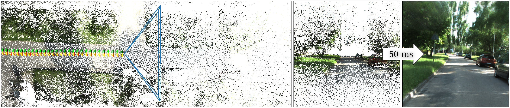
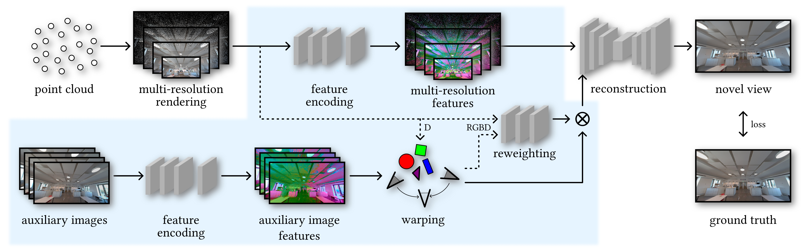
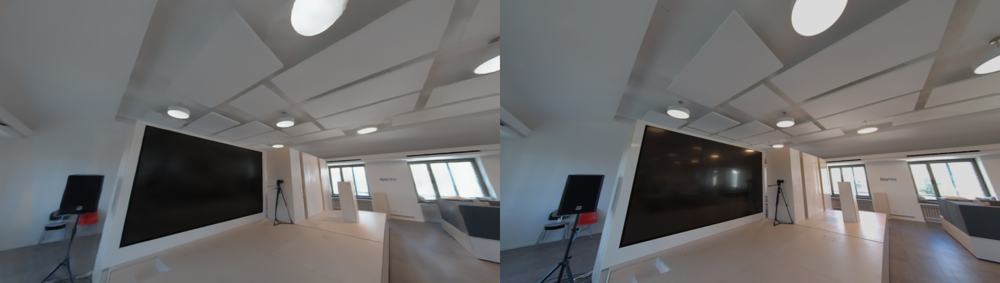
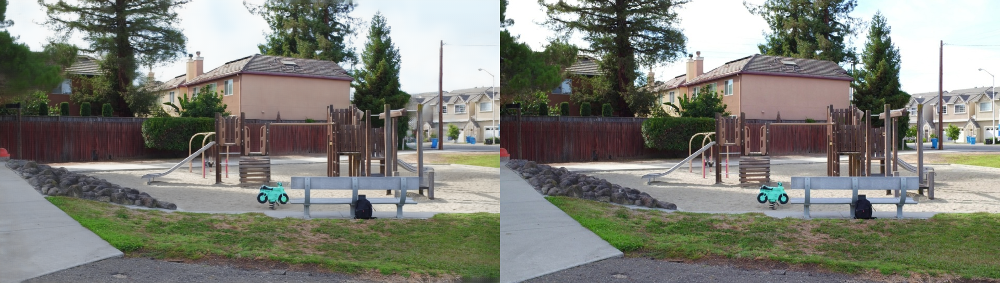
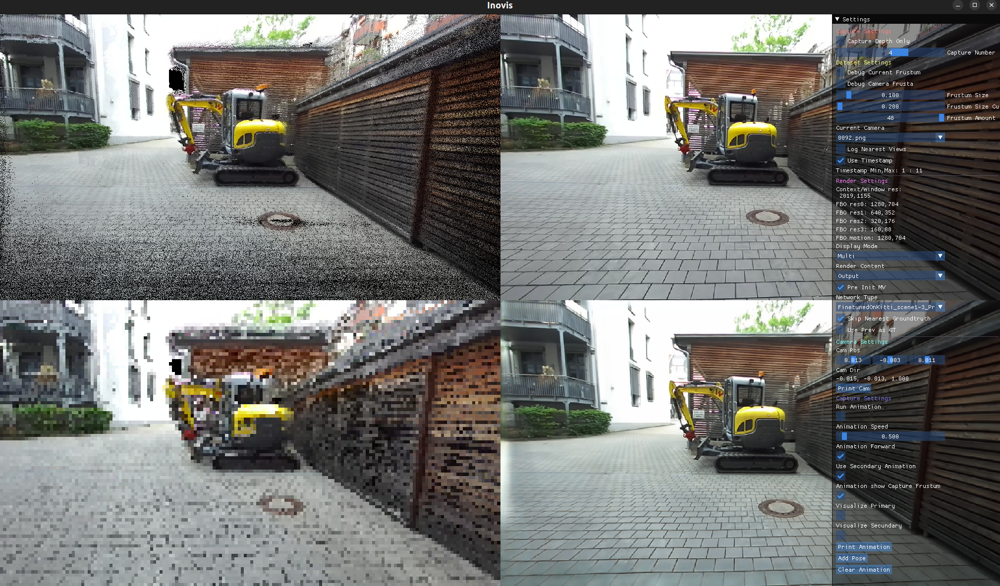

# Inovis: Instant Novel-View Synthesis
[Mathias Harrer](https://reality.tf.fau.de/staff/m.harrer.html)<sup>1</sup> , 
[Linus Franke](https://lfranke.github.io/)<sup>1</sup> , [Laura Fink](https://www.lgdv.tf.fau.de/person/laura-fink/)<sup>1,2</sup> , [Marc Stamminger](https://www.lgdv.tf.fau.de/person/marc-stamminger/)<sup>1</sup> , [Tim Weyrich](https://reality.tf.fau.de/weyrich.html)<sup>1</sup> \
<sup>1</sup> Friedrich-Alexander-Universität Erlangen-Nürnberg, Germany\
<sup>2</sup> Fraunhofer IIS, Erlangen, Germany\


**Abstract:** Novel-view synthesis
is an ill-posed problem in that it requires inference of previously
unseen information. 
Recently, reviving the traditional field of image-based rendering,
neural methods proved particularly suitable for this
interpolation/extrapolation task; however, they often require a-priori
scene-completeness or costly preprocessing steps and generally
suffer from long (scene-specific) training times.
Our work draws from recent progress in neural spatio-temporal
supersampling to enhance a state-of-the-art neural renderer's ability
to infer novel-view information at inference time.
We adapt a supersampling architecture~\cite{xiao2020neural}, which
resamples previously rendered frames, to instead recombine nearby camera images in a multi-view dataset.
These input frames are warped into a joint target frame, guided by
the most recent (point-based) scene representation, followed by neural
interpolation.
The resulting architecture gains sufficient robustness to
significantly improve transferability to previously unseen datasets.
In particular, this enables novel applications for neural rendering
where dynamically streamed content is directly incorporated in a
(neural) image-based reconstruction of a scene.
As we will show, our method reaches state-of-the-art performance when compared to previous works that rely on static and sufficiently densely sampled scenes; in addition, 
we demonstrate our system's particular suitability for dynamically streamed content,
where our approach is able to produce high-fidelity novel-view synthesis even with significantly fewer available frames than competing neural methods.

[[Webpage](https://reality.tf.fau.de/publications/2023/harrerfranke2023inovis/harrerfranke2023inovis.html)][[Paper PDF](https://reality.tf.fau.de/publications/2023/harrerfranke2023inovis/harrerfranke2023inovis.pdf)][[Paper PDF low-res](https://reality.tf.fau.de/publications/2023/harrerfranke2023inovis/harrerfranke2023inovis-lowres.pdf)][[Video](https://reality.tf.fau.de/publications/2023/harrerfranke2023inovis/harrerfranke2023inovis.mp4)][[Bibtex](https://reality.tf.fau.de/publications/2023/harrerfranke2023inovis/harrerfranke2023inovis.bib)]



## Compile Instructions:

* The live Viewer of Inovis is implemented in `C++` with `OpenGL` and `libTorch`
* The Training of Inovis is implemented in `Python` with `PyTorch`
* Install dependencies:
 ```
 sudo apt-get install cmake make g++ libx11-dev libxi-dev libgl1-mesa-dev libglu1-mesa-dev libxrandr-dev libxext-dev libxcursor-dev libxinerama-dev libxi-dev libglew-dev libglfw3-dev
 ```
* Install environment and build the `C++` application:
```
./create_environment.sh            # create conda environment inovis used for the training in Python
./install_pytorch_precompiled.sh   # install libtorch to the conda enironment folder
./build_inovis.sh                  # build the C++ executable
```
See the corresponding folders for the respective applications: 
* [neural-point-rendering-training](./neural-point-rendering-training/)  for the Python training
* [neural-point-rendering-cpp](./neural-point-rendering-cpp/)  for the interactive C++ application

#### Custom Dataset

*left:* capture image; *right:* novel view
#### Kitti-360 Dataset

*left:* capture image; *right:* novel view
#### Office Dataset

*left:* novel view; *right:* ground truth
#### Playground Dataset

*left:* novel view; *right:* ground truth
#### Interactive Viewer



