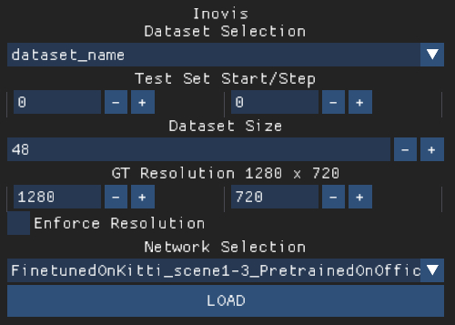

# Inovis Real-time Application

The real-time application is implemented in `C++` using `OpenGL` for point rendering and `libTorch` for network inference.
For build instructions, see the root directory.
The application can be started with the [run_inovis.sh](../run_inovis.sh) script in the root directory

## Start Menu

On Startup, the menu below is shown. 




#### Dataset Selection
Choose the dataset to load in the `Dataset Selection` dropdown menu.
A split between training and test set can be done here on a `start`/ `step` basis. `Dataset Size` depicts how many views are parsed from the dataset and the target resolution of the novel views can be adjusted here.
`Enforce Resolution` disables the internal adjustment of resolutions to be divisible by 16 (necessary because of the times 16 downsampling in the Unet).

To use a different dataset, the application must be restarted.

#### Network Selection
Choose the Network to be loaded initially in th `Network Selection` dropdown menu.

Since Networks are independent of the input data, networks can be switched during runtime, see GUI and Keybindings

## Real-time Application

After loading the dataset and networks, the view below is presented. (initially. The contensts can be adjusted.)
* *Top Left*: highest resolution point rendering
* *Top Right*: closest auxiliary image
* *Bottom Left*: lowest resolution point rendering
* *Bottom Right*: novel view


#### GUI


The GUI can be used to adjust settings. Use hotkey ```"G"``` to cycle through the GUI modes, i.e. activate performance logging and gui or disable them.

##### Capture parameters:
* `Depth Only`: Use this to create depth images if the the dataset did not support any.
* `Number Aux Images`: the number of auxiliary images created in the training dataset.
  
##### Dataset parameters:
* `Debug Current Frustum`: View the camera frustum of the currently selected View.
* `Frustum Size Current`: Size of the current views frustum.
* `Debug Camera Frusta`: View all camera frusta from the dataset.
* `Frustum Size`: Size of the view frusta.
* `Frustum Amount`: Amount of frusta rendered if `Debug Camera Frusta` is active.
* `Current Camera`: Dropdown menu for selecting a view from the dataset.
* `Log Nearest View`: Log the ids of the neraest views.
* `Use Timestamp`: If point cloud is timestamped, toggle using the whole point cloud or a subset around the current view.

##### Render parameters
* `Display Mode`: `Single` display a single view. `Multi` display 4 views.
* `Render Content`: Choose what is displayed.
* `Pre Init MV`: Activate or deactivate fallback for warping. Independent of how the network was trained. This is set to the meta data from the networks `.txt` file when loading the network.
When creating a training dataset, this impacts the dataset, as the warp vectors are different.
* `Network Type`: Which network is used for inference. These are loaded from the [networks](../networks/) folder.
* `Skip Nearest Groundtruth`: If the nearest groundtruth image is skipped. If this is deactivated, and the camera is placed on a pose from the dataset, the actual groundtruth image is used as auxiliary image. **Activate this for training dataset export.**
* `Use Prev as GT`: Whether to use the last rendered novel view as first auxiliary image. Use this for temporal smoothing.
  
##### Camera parameters:
* `Cam Pos`: Position of the camera.
* `Print Cam`: Print the current cams extrinsics-
  
##### Animation parameters:
* `Run Animation`: Whether the animation is running.
* `Animation Speed`: Modifier for animation speed.
* `Animation Forward`: Whether animation is running forward or backward.
* `Use Secondary Animation`: `ON`: Secondary, i.e. custom animation is played. `OFF`: Primary, i.e. default/capture animation is played.
* `Animation show Capture Frustum`: Whether the frustum of the capture animation is shown during playing the custom/secondary animation. Both animations are synced w.r.t. start and end of animation.
* `Visualize Primary`: Debug view to visualize the trajectory of the primary animation.
* `Visualize Secondary`: Debug view to visualize the trajectory of the secondary animation.
* `Print Animation`: Prints the trajectory of the custom animation.
* `Add Pose`: Adds the current pose to the custom animation.
* `Clear Animation`: Clears the custom animation.

#### Key Bindings
* `Mouse Click`: Camera control.
* `Mouse Wheel`: Adjust camera movement speed.
* ```W,A,S,D```: Move camera.
* ```R,F```: Move camera vertcally.
* ```ENTER```: Take screenshot.
* ```G```: Cycle through GUI modes.
* ```P```: Toggle whether animation is running. 
* ```N```: Load next network.
* ```B```: Load previous network.
* ```T```: Undo the last switch of network.
* ```O```: Toggle Display mode: one vs four images.
* ```L```: Cycle through loaded point clouds (if multiple point clouds are loaded).
* ```C```: Change output to next configuration of color buffers.
* ```X```: Change output to next configuration of color buffers.
* ```0```: Capture a dataset for training. Writes neurally rendered images to a folder ```dataset_name``` in the ```src/out``` directory. Writes training dataset to  [```neural-point-rendering-training\data\```](../neural-point-rendering-training/data/).
* ```I```: Show next pose.
* ```U```: Show previous pose.


## Datasets

To load a dataset, the dataset must be in the correct format and a dataset config file must be placed in the datasets folder, see [here](../datasets/).

TODO new dataset type and therefore format.

## Training Dataset Export

For training, the data must be converted to a image-based data format, see [here](../neural-point-rendering-training/data/).
1. Start the real-time application with the dataset to be trained on.
2. make sure to configure the viewer correctly before starting export
   1. **activate** `Skip Nearest Groundtruth` to enable skipping of the nearest groundtruth image for creation of that image. If this is not active, the nearest auxiliary image will be the actual groundtruth image, which, obviously, is to be avoided.
   2. decide if the dataset should contain the preinitialization of warp vectors / fallback for warping. Set the `Pre Init MV` accordingly:
      * `ON`: fallback is active, i.e. if for a given pixel, no point is found, the warping will fall back to a projection of the auxiliary image onto the far plane. Do this to have environment handling active in regions where no point cloud is present.  
      * `OFF`: fallback is deactivated, i.e. if for a given pixel, no point is found, the warping will not fetch any data for that pixel. Do this to have environment handling deactivated.  
3. Set the `Capture Number Aux Imgs` to the desired aux images used. We recommend 4.
4. Press `0` to start exporting the training dataset. This may take some time.
   
## Dataset Depth Images
The application requires depth images in addition to the images (RGBD input). If the dataset does not provide any, these can be rendered from the point cloud in a seperate iteration. These Depth images need to have the same resoltuion as the color images. Enter this resolution in the start menu and activate the `Enforce Resolution` option. If the resolution is not suitable for inference, inference will be turned off.

Enable the `Capture Depth Only` setting and press `0`. The depths will now be written to the training [data](../neural-point-rendering-training/data/) folder, similar to training dataset export but will have the needed resolutions. Place thes images in the original dataset and restart the real-time application with the depth images.

## Networks

Networks are stored in the networks folder and consist of 2 files, see [here](../networks/).